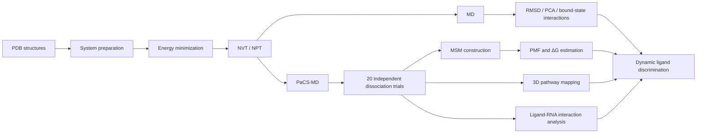

# Ligand-Specific Dissociation Pathways of preQ1 and SAM-III Riboswitches

**Simulation data and analysis workflow**

[](#)
[](#)
[](#)
[](#)
[](#)

## Overview

Riboswitches are structured RNA elements that directly recognize small metabolites and regulate gene expression.  
Although high-resolution structures provide detailed views of ligand-bound states, ligand release is a dynamic and comparatively underexplored process.

This repository supports the study:

> **Ligand-Specific Dissociation Pathways of preQ1 and SAM-III Riboswitches**

The project combines conventional all-atom molecular dynamics (MD), **parallel cascade selection molecular dynamics (PaCS-MD)**, Markov state model (MSM)-based free-energy analysis, three-dimensional pathway mapping, and ligand–RNA interaction analysis.

The central question is:

> **How do subtle chemical differences among closely related ligands redistribute local RNA interactions and redirect their preferred dissociation pathways?**

Two structurally distinct riboswitch systems were examined:

- **preQ1 riboswitch:** apo, preQ0-bound, and preQ1-bound states
- **SAM-III riboswitch:** apo, SAM-bound, SAH-bound, and EEM-bound states

The repository is intended to provide the inputs, processed data, analysis code, trajectory-derived observables, and figure-generation resources needed to reproduce the principal computational results of the manuscript.

---

## Graphical Workflow



---

## Molecular Systems

### preQ1 riboswitch

| System               | PDB ID | Ligand / PDB ligand code | Purpose                  |
| -------------------- | -----: | ------------------------ | ------------------------ |
| Apo preQ1 riboswitch | `6VUH` | —                        | Ligand-free reference    |
| preQ0-bound          | `3GCA` | preQ0 / `PQ0`            | Related precursor ligand |
| preQ1-bound          | `3Q50` | preQ1 / `PRF`            | Native ligand            |

All three systems contain the same 34-nt preQ1 riboswitch aptamer sequence.

### SAM-III riboswitch

| System      |              PDB ID | Ligand | Purpose                     |
| ----------- | ------------------: | ------ | --------------------------- |
| Apo SAM-III | derived from `3E5C` | —      | Generated by removing SAM   |
| SAM-bound   |              `3E5C` | SAM    | Native ligand               |
| SAH-bound   |              `3E5E` | SAH    | Demethylated related ligand |
| EEM-bound   |              `3E5F` | EEM    | SAM-related analogue        |

> **Note:** the SAM-III apo structure is a ligand-removed model derived from the SAM-bound experimental structure and should not be interpreted as an experimentally determined apo ensemble.

---

## Main Findings

### 1. preQ1 riboswitch

- Conventional MD indicated that ligand binding restricts the conformational space of the RNA relative to the apo state.
- preQ0 predominantly maintained one stable ligand pose, whereas preQ1 sampled two bound conformations associated with different hydrogen-bonding patterns.
- In 20 independent PaCS-MD trials:
  - **preQ0:** mean dissociation requirement = **52.5 cycles**
  - **preQ1:** mean dissociation requirement = **93.3 cycles**
  - Mann–Whitney U test: **p = 1.96 × 10⁻⁵**
- MSM-based estimates of standard binding free energy:
  - **preQ0:** **−26.3 ± 7.4 kJ mol⁻¹**
  - **preQ1:** **−32.8 ± 6.1 kJ mol⁻¹**
- Both ligands sampled two major spatial release routes, but their **dominant dissociation directions differed strongly**.
- The pathway preference was associated primarily with:
  - **π–π stacking:** U12 and A29
  - **van der Waals contacts:** C16 and C30

<p align="center">
  
</p>


<p align="center"><em>Representative spatial dissociation pathways and interaction features for preQ0 and preQ1.</em></p>

---

### 2. SAM-III riboswitch

- SAM, SAH, and EEM displayed ligand-dependent retention and release behavior.
- In 20 independent PaCS-MD trials per ligand:
  - **SAM:** **47.9 cycles**
  - **SAH:** **36.1 cycles**
  - **EEM:** **39.3 cycles**
- One-way ANOVA showed an overall difference among the three groups:
  - **F(2,57) = 5.476**
  - **p = 0.00668**
- Tukey HSD identified a significant difference between **SAM and SAH**; SAM–EEM and SAH–EEM were not statistically significant.
- MSM-based free-energy estimates:
  - **SAM:** **−30.5 ± 7.6 kJ mol⁻¹**
  - **SAH:** **−28.6 ± 15.4 kJ mol⁻¹**
  - **EEM:** **−31.5 ± 12.3 kJ mol⁻¹**
- Spatial pathway mapping showed:
  - **SAM and EEM:** two major lateral release pathways
  - **SAH:** a more localized frontal release pathway
- These differences were associated mainly with:
  - **hydrogen bonds:** A28 and A38
  - **van der Waals contacts:** A28 and G35
- π–π stacking was comparatively rare during SAM-III ligand dissociation.

<p align="center">
  
</p>


<p align="center"><em>Representative spatial dissociation behavior and interaction features for SAM, SAH, and EEM.</em></p>

---

## Computational Protocol

### System preparation

The simulations were prepared using an AMBER-based parameterization workflow and subsequently run in GROMACS.

| Component              | Setting             |
| ---------------------- | ------------------- |
| RNA force field        | AMBER RNA.OL3       |
| Ligand force field     | GAFF2               |
| Ligand charges         | RESP                |
| Solvent model          | OPC water           |
| Salt concentration     | 0.10 M KCl          |
| Temperature            | 303.15 K            |
| Pressure               | 1 bar               |
| preQ1 simulation box   | cubic, 7.8 nm edge  |
| SAM-III simulation box | cubic, 15.0 nm edge |

Ligand preparation involved Avogadro, Gaussian/RESP calculations, Antechamber, Parmchk2, and LEaP before conversion to GROMACS-compatible topology files.

---

## PaCS-MD Settings

The progress coordinate used for production PaCS-MD was the **ligand displacement from its initial bound position after fitting the RNA structure**.

The original ligand–pocket center-of-mass distance was tested but was unsuitable because the U-shaped RNA binding pocket allowed the ligand to increase this distance without necessarily escaping into bulk solvent.

```yaml
PaCS-MD:
  replicas_per_cycle: 64
  segment_length_ps: 100
  independent_trials_per_ligand: 20
  progress_coordinate:
    type: ligand_displacement_from_initial_bound_position
    alignment: fit_RNA_before_measurement
  dissociation_threshold_nm: 5.0
  maximum_cycles: 200
```

> PaCS-MD cycle counts are interpreted here as a **comparative measure of ligand retention under the same sampling protocol**. They are not direct experimental dissociation rates (`koff`) or rigorous kinetic constants.

---

## MSM and Free-Energy Analysis

Ligand dissociation trajectories were represented primarily using the ligand–RNA distance coordinate and clustered by K-means. MSMs were estimated using reversible maximum likelihood.

```yaml
MSM:
  clustering:
    method: k_means
    tested_n_clusters: [100, 80, 60, 40, 20]

  preQ1:
    final_n_clusters: 20
    lag_frames: 20
    lag_time_ps: 10

  SAM-III:
    final_n_clusters: 20
    lag_frames: 40
    lag_time_ps: 20

  diagnostics:
    - implied_timescales

  free_energy:
    observable: PMF
    source: stationary_distribution
    standard_state_correction: volume_correction
```

The standard-state binding free-energy estimate includes a translational volume correction based on the accessible unbound ligand volume.

---

## Ligand–RNA Interaction Definitions

Three classes of interactions were analyzed along the dissociation coordinate.

```python
interaction_definition = {
    "hydrogen_bond": {
        "algorithm": "Baker-Hubbard",
        "donor_acceptor_cutoff_nm": 0.30,
        "angle_cutoff_deg": 120
    },
    "van_der_Waals_contact": {
        "interatomic_distance_cutoff_nm": 0.30
    },
    "pi_pi_stacking": {
        "aromatic_center_distance_cutoff_nm": 0.50
    }
}
```

Interaction counts were normalized by the number of frames within each ligand–RNA distance bin so that contact persistence could be compared as dissociation progressed.

---

## Software Used

The computational workflow used the following tools:

- **GROMACS** — molecular dynamics
- **AMBER / AmberTools**
  - Antechamber
  - Parmchk2
  - LEaP
- **GAFF2** — ligand force-field parameters
- **Gaussian** — electrostatic calculations for RESP fitting
- **Avogadro** — ligand preparation / geometry handling
- **Python**
- **deeptime** — Markov state model construction
- **scikit-learn** — K-means clustering
- **MDTraj** — trajectory and hydrogen-bond analysis
- **MDAnalysis** — trajectory processing and ligand COM extraction
- **ChimeraX** — three-dimensional pathway visualization

> Exact software versions should be recorded in `environment/versions.txt` or an equivalent environment file before archival release.


## Reproducing the Analysis

### 1. Clone the repository

```bash
git clone https://github.com/<YOUR_GITHUB_USERNAME>/<REPOSITORY_NAME>.git
cd <REPOSITORY_NAME>
```

### 2. Create the analysis environment

If a Conda environment file is provided:

```bash
conda env create -f environment/environment.yml
conda activate riboswitch-pacsmd
```

or, using `pip`:

```bash
python -m venv .venv
source .venv/bin/activate
pip install -r environment/requirements.txt
```

### 3. Verify data integrity

For a public release, we recommend providing checksums for large input and trajectory files.

```bash
sha256sum <trajectory_file.xtc>
sha256sum <topology_file.tpr>
```

### 4. Analysis order

The principal analyses should be reproduced in the following order:

```text
conventional MD
    │
    ├── RMSD
    ├── ligand conformational-state analysis
    └── RNA PCA

PaCS-MD
    │
    ├── cycle-count statistics
    ├── ligand-RNA distance extraction
    ├── MSM / PMF reconstruction
    ├── 3D dissociation-pathway mapping
    └── ligand-RNA interaction analysis
```

Each analysis folder should contain a short local `README.md` documenting:

1. required input files,
2. command or script used,
3. relevant parameters,
4. expected outputs, and
5. mapping between output files and manuscript figures.

---

## Figure-to-Data Mapping

For reproducibility, processed source data for each manuscript figure should be deposited in machine-readable form whenever possible.

| Manuscript result              | Recommended repository location |
| ------------------------------ | ------------------------------- |
| Conventional MD RMSD           | `data/rmsd/`                    |
| preQ1 PCA                      | `data/pca/`                     |
| PaCS-MD cycle traces           | `data/cycle_counts/`            |
| MSM implied timescales         | `data/msm/`                     |
| PMF / ΔG estimates             | `data/pmf/`                     |
| 3D ligand release trajectories | `data/pathways/`                |
| H-bond / vdW / π–π data        | `data/interactions/`            |
| Main manuscript figures        | `figures/main/`                 |
| Supplementary figures          | `figures/supplementary/`        |

CSV/TSV files are preferred for plotted numerical data because they are lightweight, transparent, and easy to reuse.

---

## Large Trajectory Files

Raw MD and PaCS-MD trajectories can easily exceed normal GitHub repository limits.

A practical archival strategy is:

1. keep **analysis scripts, input parameters, processed data, representative trajectories, and figure-source data** on GitHub;
2. archive large raw trajectories in a persistent research-data repository such as **Zenodo**;
3. add the archival DOI to this README and to the manuscript Data Availability Statement.

Example:

```markdown
Large raw trajectory files are archived at Zenodo:
https://doi.org/<ZENODO_DOI>
```

If all trajectory files are stored directly through GitHub infrastructure, use **Git LFS** rather than committing large binary files to normal Git history.

```bash
git lfs install
git lfs track "*.xtc"
git lfs track "*.trr"
git lfs track "*.tpr"
git add .gitattributes
```

---

## Interpretation Notes

A few methodological points are important when reusing these data:

- **PaCS-MD cycle number is not a direct kinetic constant.** It is used as a comparative retention metric under an identical sampling protocol.
- **PMF/free-energy values depend on sampling, state definitions, and the chosen reaction coordinate.** Relative trends should therefore be interpreted more strongly than small differences between overlapping uncertainty ranges.
- **Spatial labels such as “left”, “right”, and “front” are defined relative to the common aligned RNA viewing orientation used for pathway visualization.**
- Residues identified by interaction analysis are **associated with** pathway preference; causal roles require perturbation, mutation, or experimental validation.
- The present work focuses primarily on **dissociation**, rather than the complete association/rebinding process.

---

## Data Availability

The goal of this repository is to make the computational results underlying the manuscript transparent and reusable.

The final public release should contain:

- simulation starting structures;
- force-field and topology files required to reconstruct the systems;
- MD and PaCS-MD input parameters;
- PaCS-MD progress-coordinate definitions;
- per-trial cycle-count data;
- processed coordinates used for pathway analysis;
- MSM input data and parameter-selection results;
- PMF/free-energy source data;
- ligand–RNA interaction data;
- figure-generation data and analysis scripts;
- representative trajectories and/or links to the archive containing the complete trajectories.

### Suggested manuscript Data Availability Statement

> **Data Availability.** Simulation input files, analysis scripts, processed data, and figure-source data supporting the findings of this study are publicly available in this GitHub repository. Large raw molecular-dynamics and PaCS-MD trajectory files are available through the archival repository linked here: **[DOI/URL to be added]**.

## Contact

**Yilan Bai**  bai.y.2355@m.isct.ac.jp
Kitao Laboratory, Graduate School of Life Science and Technology, Institute of Science Tokyo

For questions about the repository, please use the GitHub **Issues** page or contact the corresponding author listed in the manuscript.

---

## Acknowledgments

This repository supports computational research performed in the **Kitao Laboratory, Institute of Science Tokyo** under the supervision of **Prof. Akio Kitao**.
